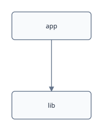

# Architecture That Draws Itself

An architecture diagram is the one claim in a repository nothing re-reads: it
is right the day it is drawn and wrong within a quarter, silently. This
document closes the loop three ways at once — the code is here, a
deterministic scan deduces its shape (no model, no API key, nothing to
install beyond `hick`), the scan's output is pinned, and the picture is
DERIVED from that pinned output. When the architecture changes, the cell
fails; nobody has to remember the diagram exists.

## The code

Two modules and one rule: `app` may call `lib`, never the reverse.


### `demo/lib/orders.py`

```python
def load_orders():
    return []
```


### `demo/app/main.py`

```python
load_orders()
```


## The scan, and the pin

`hick diagram` walks a folder gitignore-aware, reads structure with
tree-sitter (compiled into the binary, works offline), and emits a scene
topology — nodes and edges, never a layout, because arranging boxes is a
person's decision and a generator that writes positions destroys them on
every run. Resolution is by NAME, and the tool says so: this is a place to
start looking, not a compiler's call graph.

The expect below pins the whole topology. The day someone adds an import that
changes the shape, this cell — and therefore `hick test`, and therefore the
pre-commit hook — fails.

$ hick diagram demo --group dir --format scene
{
  "nodes": [
    {
      "id": "app"
    },
    {
      "id": "lib"
    }
  ],
  "edges": [
    {
      "from": "app",
      "to": "lib"
    }
  ]
}


The fragment below is the same topology, stated where a diagram can paste it.
An exec's output is deliberately not paste-able — the fragment plus the
expect above is the mechanism that keeps a stated copy honest. When the code
changes shape, refresh it deterministically with:

```
hick diagram demo --refresh architecture-that-draws-itself.hick --fragment arch-topology
```

## The picture

A `renderer="graph"` diagram whose topology is PASTED, not drawn: in the app
this is an interactive canvas — drag the boxes where they mean something —
and the editor will rewrite only the `layout` below, because the nodes and
edges belong to the scan. The weave you are reading renders it as an SVG the
weave itself drew — the same boxes, in the same places.





## The precise version, when you have a toolchain

Name resolution is honest but approximate. When the project has a real
toolchain, SCIP is the compiler-grade version of the same scan — and it runs
the doctrinal way, as a cell in a container YOU build (no public image
carries a language indexer, the `scip` CLI, and `jq` together):

```
<hick:container name="scip" image="scip-tools:local" />

<hick:exec id="arch-scan-precise" container="scip" mount="demo:project">
cd project && scip-python index . --project-name demo
scip print --json index.scip | jq -c '{
  nodes: [.documents[].relative_path | split("/")[0]] | unique | map({id: .}),
  edges: [.documents[] as $d | $d.occurrences[]
    | select(.symbol | startswith("scip-python") and (contains($d.relative_path | split("/")[0]) | not))
    | {from: ($d.relative_path | split("/")[0]), to: (.symbol | capture("`(?<m>[^`]+)`").m | split(".")[0])}]
    | unique }'
</hick:exec>
```

Both emit the same shape, so the same fragment — and therefore the same
derived diagram — consumes either. Swapping the approximate scanner for the
precise one changes one cell, not the picture.
