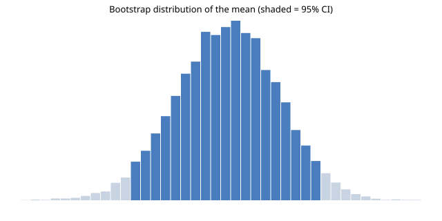

# The Bootstrap, Reproduced

A statistical paper you can re-run. This document estimates a 95% bootstrap
confidence interval for the mean of a small sample, generates its own figure,
and verifies its own numbers. Nothing here is pasted in; every value is
computed when the document is built, from a fixed seed.

## The sample

$ python3 - <<'EOF'
  import random
  random.seed(42)
  sample = [round(random.gauss(50, 12), 1) for _ in range(30)]
  with open("sample.txt", "w") as f:
      f.write("\n".join(map(str, sample)))
  print(f"n = {len(sample)}")
  print(f"mean = {sum(sample)/len(sample):.2f}")
  EOF
n = 30
mean = 50.28

## Resampling

We draw 10,000 bootstrap resamples and take the 2.5th and 97.5th percentiles
of the resampled means.

$ python3 - <<'EOF'
  import random
  random.seed(7)
  sample = [float(x) for x in open("sample.txt")]
  n = len(sample)
  means = sorted(
      sum(random.choices(sample, k=n)) / n
      for _ in range(10_000)
  )
  lo, hi = means[249], means[9749]
  print(f"95% CI: [{lo:.2f}, {hi:.2f}]")
  with open("ci.txt", "w") as f:
      f.write(f"{lo:.4f} {hi:.4f}")
  EOF
95% CI: [47.33, 53.17]

## The figure

The histogram below is an SVG generated from the bootstrap distribution —
regenerated on every build, so the figure can never drift from the data.

## Why this matters

Most published figures cannot be regenerated from their paper. This one is
regenerated on every run of `hick run`, and `hick test` fails the
build if the computed interval stops matching the prose above. The document
is the analysis.
